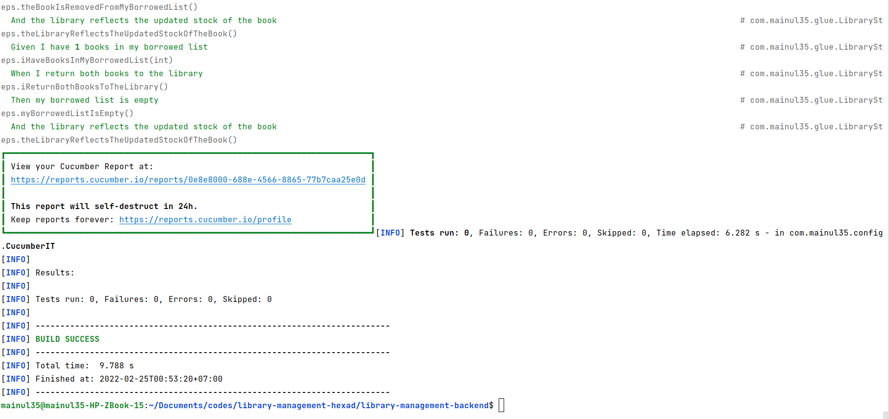
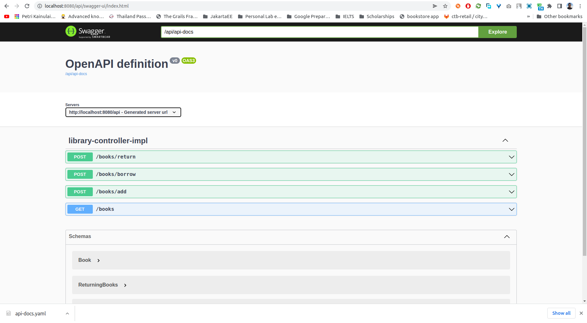
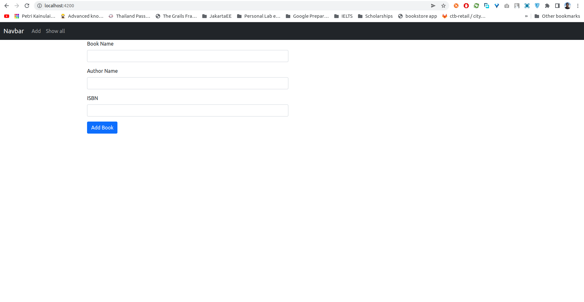
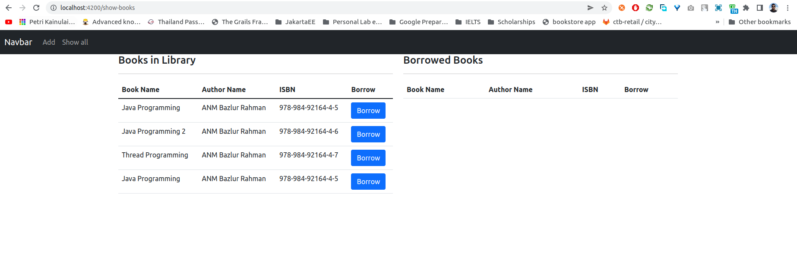
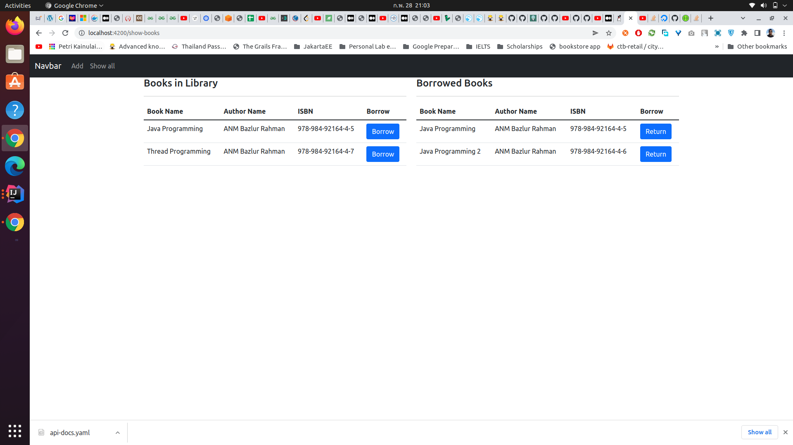
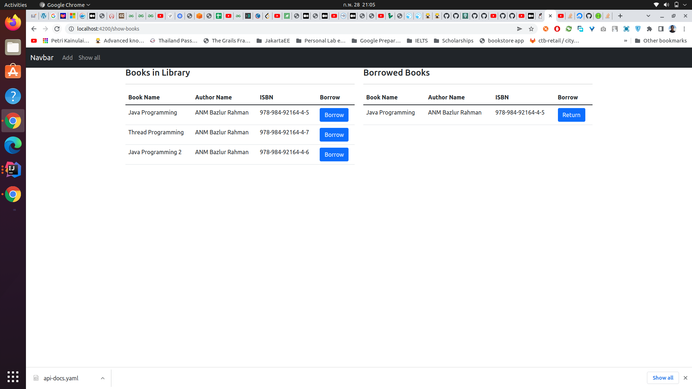

# library-management-hexad

### Assumptions

1. For simplicity and since integrating a database was not mentioned as mandatory, it has been skipped.
2. After reading the patterns of test cases, these seemed that cucumber would be the best choice, so I used cucumber (I used JUnit before but not cucumber, so I learnt it).
3. Test data are populated from a JSON file, which is kept in test/resources folder.
4. There was a user mentioned, but login to the application was not mentioned. Hence, to avoid login related complexity, I avoided integrating Spring Security.

However, the application is currently at such a state than, extension to make the application secured or integrating any persistence storage can be done if needed.

### Additional works added

1. Logging configuration
2. Added Swagger with OpenAPI specification
3. Exception handling

### Plans for extension

1. The swagger UI currently we have is very minimum. It requires some additional configuration to make better
2. In front end, user experience can be more improved by keeping all in one page. I will work on that.
3. The running process is not much straightforward. I have a plan to put the services in docker and managing with docker-compose. I have a room to learn and integrate too.

### How to run the unit tests

Navigate inside the backend project

```
cd library-management-backend
```

Now run ``mvn test``. You are likely to see the following output in the console if all the tests are successful.


Click on the link, and it will take you to the report of the tests in cucumber site.

### Running the application server

From the ``library-management-backend`` run the command ``mvn spring-boot:start`` in the command line. It will start the application.

##### Swagger Endpoint

Go to browser and in the address bar go to http://localhost:8080/api/swagger-ui/index.html

This will bring you a very minimal swagger ui.



### Running the web server

Navigate to the ``library-management-frontend`` module. First run ``npm install`` for installing the application. Then run the command `ng serve`. It will take to the book adding form.



Add some books. Then navigate to **Show all** menu. You can see added books in the library.


Click on **Borrow** button, and books will be added in your borrowed list.



Click on **Return** button to return books.

